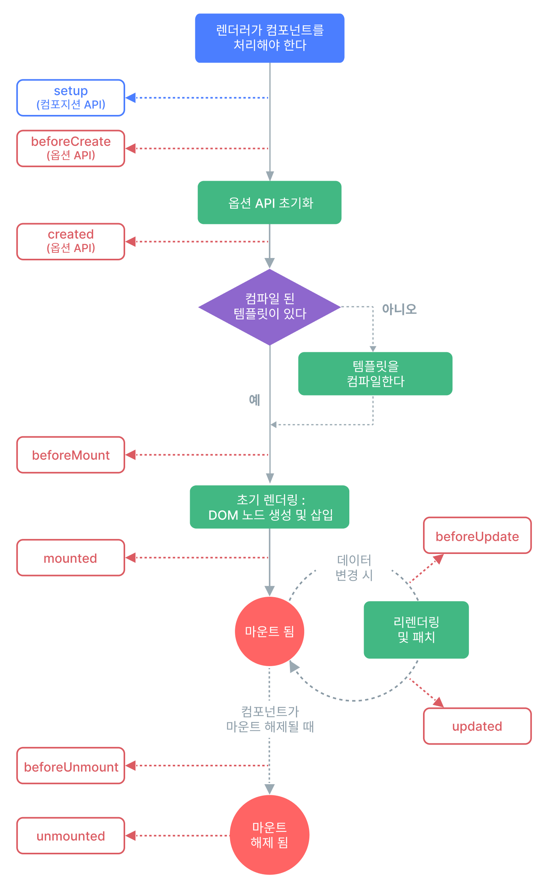

# 유투브 9din Vue3 무료 강의
[9Din 유투브 강의 재생목록 링크](https://www.youtube.com/watch?v=wCyF_bU9X0I&list=PL-cIzvS-5d-1httQSLn0rd3FIlwf-uMYF&index=2)  
Vue2 기반 OptionsAPI 기본문법 적용 후 CompsotionAPI 문법을 간단하게 적용해본다.

# Vue.js란?
<details>
<summary>펼치기/접기</summary>
<br>

웹 사용자 인터페이스를 만들기 위한 쉽고 강력하며 다재다능한 프레임워크이다.  
웹 프론트엔드 시장에서 가장 많이 사용되는 스택은 React 이고, 그 다음으로 Vue.js이다.  
후발주자로 Svelte가 빠르게 치고 올라고오 있으나, 아직 React와 Vue.js를 대체할 수준까진 아니다.
Vue.js를 선택하는 이유는 접근성과 낮은 러닝커브이다.  
웹 개발을 처음 시작한 사람들, 초보자들에게 Vue.js라는 선택지는 쉽게 접근할 수 있고 쉽게 입문할 수 있다는 가장 큰 장점이 있다.  
그러나 쉽다고 퍼포먼스가 전혀 낮은것은 아니다.  
다른 프론트엔드 툴과 견주어도 절대 뒤쳐지지 않는 성능을 낼 수 있다.  
그렇기에 메인 툴로 선정하여도 훌륭한 선택지가 될 수 있다.  

Vue.js는 프레임워크이다.  
리액트는 사용자 인터페이스를 만들기 위한 자바스크립트 라이브러리라고 표현하고 있다.  
라이브러리는 개발자들이 개발을 최소한으로 편리하게 하기 위해 만든 모듈이다.  
가구에 빗대어 표현해보자면, 라이브러리는 어떤 책상을 만드는데 필요한 재료들이라고 생각하면 된다.  
반면 프레임워크는 이러한 가구들이 미리 조립되어있는 상태를 말하며 가구들을 활용하여 리모델링을 이룬다.  
이처럼 프레임워크는 라이브러리의 집합체 더 큰 개념이라고 이해하면 된다.  
따라서 라이브러리같은 경우에는 기능상의 통제권이 개발자, 즉 사용자에게 있는 반면 프레임워크는 통제권이 프레임워크에 있다.  
따라서 프레임워크는 큼직한 기능들이 미리 세팅되어 있는 완성형 도구라고 생각하면 된다.  
그러므로 Vue.js는 타 개발도구들 보다 자유도는 비교적 낮을 수 있지만 협업에 있어 약속된 기능들을 사용하기 때문에 코드가 명시적이라는 장점이 있다.  

다음으로 Vue.js의 구조를 알아보자.  
Vue.js의 구조는 딱 2가지만 알고있으면 된다.  
첫번째로는 `SPA` 구조라는것 두번째로는 `SFC` 구조라는것

먼저 `SPA` 구조는 `Single Page Application`의 약자로 말 그대로 하나의 페이지에서 유저가 원하는 정보만 보여주는 방식이다.  
페이지를 구성하는 HTML파일이 하나만 있다는것을 의미한다.  
HTML파일 안에서 사용자가 요청하는 페이지의 정보만 불러오는 구조라고 이해하면 된다.  
즉, 하나의 HTML파일의 body태그 안에서 보여지는 것들이 유저의 요청에 의해서 바꿔치기 되는 형식이다.  

다음으로는 `SFC` 구조이다.  
Vue.js 확장명은 .vue이다.  
해당 파일 안에서 HTML, CSS, JS가 관리된다.  
하나의 컴포넌트 안에서 이 모든게 관리가 된다고 하여 `Single File Component`라고 부른다.  

</details>
<br>

# Vue.js 개발 스타일
<details>
<summary>펼치기/접기</summary>
<br>

Vue.js 개발 스타일에는 `Options API`와 `Composition API` 두 가지 방식이 있다.

### 1. Options API
- data, methods, mounted 같은 객체를 사용하여 컴포넌트 로직을 정의하는 개발 스타일이다.  
- 옵션으로 정의된 속성은 컴포넌트 인스턴스를 가리키는 함수 내부의 this에 노출된다.  
### 2. Composition API
- import를 통해 가져온 Vue.js 내장 API 함수를 사용하여 컴포넌트 로직을 정의하는 개발 스타일이다.
- SFC에서 컴포지션 API는 일반적으로 `<script setup>` 과 함께 사용한다.
  (setup 속성은 컴파일시 의도된 대로 올바르게 동작할 수 있게 코드를 변환하도록 하는 힌트이다.)

### Options API vs Composition API
- 어떤 개발스타일이 더 좋고 나쁘고는 없으며 본인 취향에 맞게 개발하면 된다.  
- 협업에 있어 옵션 API의 코드가 가독성이 좋을 경우도 있기 때문에 맡은 프로젝트에 따라 선택하면 된다.


## Options API 정리
|   daat   |    methods   |   LifeCycle   |
|----------|--------------|---------------|
|Data 메소드는 해당 컴포넌트에서 사용될 state <br> 즉 데이터를 관리해주는 곳이다.|Mehods는 속성값을 변경하고 업데이트 할 수 있는 함수이며, <br> 템플릿 내에서 이벤트 핸들러로 바인딩이 가능하다.|생명주기 훅(LifeCycle hooks)은 컴포넌트 생명주기의 여러단계에서 호출된다.|  
|data에서 반환된 속성들은 반응적인 상태가 되어 this에 노출된다.|methods에서 반환된 함수들은 data에서 반환된 속성과 마찬가지로 this에 노출된다.||  

## Composition API 정리
|   ref, reactive   |   methods   |   LifeCycle   |
|-------------------|-------------|---------------|
|컴포지션 API에서는 반응성 있는 데이터를 만들어 줄 경우, <br>ref 혹은 reative 키워드를 통하여 변수를 선언해준다. |컴포지션 API에서는 methos라는 객체를 선언할 필요가 없기 때문에 함수를 그냥 만들어 사용하면 된다.|생명주기 훅(LifeCycle hooks)은 컴포넌트 생명주기의 여러단계에서 호출된다.|  
|`const count = ref(0)`<br>┗ 초기값을 0으로 설정<br>`const obj = reactive({`<br>`name: 'test', age: 30`<br>`})`|`function increment() {count.value++}`<br>┗ ref로 참조한 데이터에 접근할 경우에는 `.value`로 접근한다.||  

</details>
<br>


# Vite기반 Vue3 프로젝트 세팅
<details>
<summary>펼치기/접기</summary>
<br>

1. 설치 명령 입력
  ```
  PS C:\프로젝트설치 상위경로> npm create vite@latest
  ```

2. 프로젝트명 입력
  ```
  PS C:\Programming\workspace_vs> npm create vite@latest
  ? Project name: » {프로젝트명}
  ```

3. 프레임워크 Vue 선택
  ```
  PS C:\Programming\workspace_vs> npm create vite@latest
  √ Project name: ... vue3-vite-9din-basic
  ? Select a framework: » - Use arrow-keys. Return to submit.
      Vanilla
  >   Vue
      React
      Preact
      Lit
      Svelte
      Solid
      Qwik
      Angular
      Others
  ```

4. 사용 언어 Javascript 선택
  ```
  PS C:\Programming\workspace_vs> npm create vite@latest
  √ Project name: ... vue3-vite-9din-basic
  √ Select a framework: » Vue
  ? Select a variant: » - Use arrow-keys. Return to submit.
      TypeScript
  >   JavaScript
      Official Vue Starter ↗
      Nuxt ↗
  ```

5. 설치 완료 후 출력문
  ```
  Scaffolding project in C:\Programming\workspace_vs\vue3-vite-9din-basic...

  Done. Now run:

    cd vue3-vite-9din-basic
    npm install
    npm run dev
  ```
  
6. Node.js 의존성 라이브러리 설치
  ```
  npm install
  ```
  
7. 서버 기동
  ```
  npm run dev
  ```
</details>
<br>

# LifeCycle 이론 01
<details>
<summary>펼치기/접기</summary>
<br>

### 1. 컴포넌트 생성 (new Vue Component)  
   각각의 Vue 컴포넌트 인스턴스는 생성될 때, 일련의 초기화 과정을 거친다.  
   컴포넌트가 생성되고 소멸되기까지의 단계를 말하며, 각 단계에서 실행되는 함수들을 라이프사이클 훅이라 부른다.  
   *Created, Mounted, Updated 3가지 훅이 가장 많이 사용된다.*
### 2. Created  
   템플릿 및 Virtual Dom이 마운팅 혹은 렌더링 되기 전에 실행되며, 데이터와 이벤트가 활성화되어 접근할 수 있다.  
   *따라서 data와 methods에 선언된 변수와 함수에 접근할 수 있다.*
### 3. Mounted  
   컴포넌트가 초기 렌더링 및 DOM 노드 생성이 완료된 후, 코드를 실행하는데 사용할 수 있다.  
   *SFC 구주에서 Template 부분이 그려진 후에 코드를 실행하는데 사용할 수 있다.*  
   *화면요소를 제어하는 로직을 수행하기에 굉장히 좋은 단계이다.*  
   *즉 UI를 컨트롤 하는 부분이라고 이해하면 된다.*  
### 4. Updated  
   컴포넌트가 데이터가 변경되어 DOM이 렌더링된 후 실행된다.  
   또한, Property가 변경된 후 DOM에 접근할 때 사용한다.  
      

가장 먼저 라이프사이클을 이해하려면 그리고 어떻게, 어느순간에 동작하는지를 파악하려면 컴포넌트 즉 프로그래밍 인스턴스를 생성해야한다.  
위 4개 목록중 1번 컴포넌트 생성 부분이 이에 해당한다.  
설명상의 인스턴스란 객체지향 프로그래밍에서 클래스에 소속된 개별적인 객체를 말한다.  
하나의 클래스를 사용하여 유사한 성질을 가진 수많은 인스턴스를 생성할 수 있다.  
Vue.JS라는 자바스크립트 프레임워크를 통해 유사한 성질. 즉, Vue.js가 가지고 있는 내장된 함수를 활용할 수 있는 수많은 컴포넌트를 생성하여 활용할 수 있다.  
인스턴스는 Vue.Js에서 각각의 컴포넌트를 의미한다.  

붕어빵을 예로 든다면, 붕어빵을 만드는 틀, 기계 자체는 클래스이고 붕어빵은 오브젝트이다.  
그리고 붕어빵이 만들어지는 과정이 인스턴스화 이며 틀을 이용해서 만든 각각의 붕어빵들이, 완제품들이 인스턴스이다.  
붕어빵 기계라는 클래스에서 `굽다` 라는 메소드를 실행시켜 붕어빵을 굽는다.  
굽다라는 메소드는 Vue.js에서 라이프사이클에 해당한다.  
그리고 만들어진 붕어빵들은 전부 객체들이다.  
하지만 같은 기계에서 만들어졌어도 서로 다른 밀가루양과 팥을 가지고 있다.  
실제로 만들어진 붕어빵인 이것이 인스턴스이며, 이 빵을 구븐 행위가 인스턴스화 이다.
</details>
<br>

# LifeCycle 이론 02
<details>
<summary>펼치기/접기</summary>
<br>

### 1. Created  
  - 컴포넌트가 생성된 직후에 접근할 수 있는 라이프사이클 훅이다.
  - beforeCreated 라이프사이클 훅에선 컴포넌트가 생성되기 전에 동작하는 기능이기 때문에 data, methods에 선언한 데이터, 함수에 접근할 수 없다.
### 2. Mounted  
  - 컴포넌트, 템플릿, 렌더링된 DOM에 접근할 수 있고, DOM을 수정하기 위해 사용된다.  
  - template 부분의 HTML Element가 모두 렌더링 된 후에 접근이 가능하다.


위 이미지를 보면 Vue.JS에서 각각의 컴포넌트를 관리하고 호출해서 렌더링할 때 위와같은 도표로 실행된다.  
최초로 컴포넌트를 만들었고 해당 컴포넌트를 호출하여 사용한다고 가정해본다.  
그러면 그 컴포넌트는 렌더러에게 "이 컴포넌트를 처리해줘!" 라고 요청을 할것이다.  
그 다음 컴포넌트를 처리해달라고 요청을 받았으면 해당컴포넌트를 불러올것이다.  
그리고 생성을 해야 그 컴포넌트를 사용할 수 있다.  
이때 호출한 컴포넌트를 생성하기 전에 접근할 수 있는 부분이 바로 `beforeCreated(Options)`/`setup(Composition)` 라이프사이클 훅이다.  
그래서 컴포넌트가 생성되기 전에 어떤 작업을 해주고 싶을 때 해당 라이프사이클 훅을 사용하면 된다.  
실무에서는 많이 사용되지는 않지만 이러한 개념을 알아 둔다면 혹여나 필요한 상황에서 용이하게 사용할 수 있다.  

Options API의 경우 초기화 과정을 거친다. (Composition API도 동일)  
그리고 컴포넌트를 생성한다.  
그래서 초기화하는 시점에 Options API 같은 경우 data, methods와 같은 부분에 선언했던 변수나 함수 등  
활용하기 위해 선언한 데이터들을 this 키워드로 접근할 수 있게끔 세팅이 된다.  
이후 created 훅이 동작을 하며, 어원 그대로 생성된 후/생성된 직후 컴포넌트 내에 선언한 데이터에 접근(this.키워드로)할 수 있다.  


Composition API의 경우 `beforeCreated`, `created` 라이프사이클 훅을 사용하지 않고 setup이라는 키워드를 사용함으로써 그 기능을 대체하고 있다.
(script 태그 속성으로 사용하거나 setup(){} 함수를 정의하여 함수 블록 내부에서 코드를 작성하여 사용하게 될 경우 해당 기능을 대체한다.)  

컴포넌트가 생성이 되었으면, 템플릿 부분을 컴파일 해야 선언한 데이터를 활용하여 UI를 그려낼 수 있을것이다.  
이때 컴파일된 템플릿이 없으면 템플릿을 컴파일하면 되고 이미 있다면 초기 렌더링 단계로 진입을 하면 된다.

초기 렌더링: DOM 노드 생성 및 삽입 즉, Template 키워드 안에 있는 HTML구조 뼈대를 웹 상에 그려내기 전에 컨트롤 할 필요가 있을 경우 `Options API는 beforeMounted` 라이프사이클 훅을. `Composition API는 onBeforeMounted` 라이프사이클 훅을 사용한다.  
또한 템플릿 부분의 HTML Element가 모두 렌더링 된 후 접근할 땐 `OptionsAPI는 Mounted`, `Composition API는 onMounted` 라이프사이클 훅을 통해 접근이 가능하다.  

마운트가 된 후 데이터가 변경되어 새롭게 UI를 그려내야할 경우 `Options API는 updateed` 라이프사이클 훅이. `Composition API는 onUpdateed` 라이프사이클 훅이 동작하고 마찬가지로 데이터가 변경되고 새롭게 리렌더링 및 패치를 하기 전에 컨트롤 해줘야할 부분이 있다면 `Options API는 beforeUpdateed` 라이프사이클 훅을. `Composition API는 onBeforeUpdateed` 라이프사이클 훅을 사용한다. 

마운트가 해제된 후 즉, 인스턴스를 제거하기 전 접근할 수있는 라이프사이클 훅은 `Options API는 beforeUnmounted` 라이프사이클 훅이. `Composition API는 onBeforeUnmounted`

인스턴스가 제거된 후 라이프사이클 훅은 `Options API는 unmounted` 라이프사이클 훅이. `Composition API는 onUnmounted` 라이프사이클 훅이 동작하게 된다.  

</details>
<br>

# LifeCycle 실습 예제
<details>
<summary>펼치기/접기</summary>
<br>


## beforeCreate() , created()

state 데이터와 관련이 있다.

1. 렌더러가 컴포넌트를 처리해야한다. 라는 명령을 받는다.  
2. beforeCreate: 컴포넌트가 생성되기 전 특정 로직을 처리해주거나 필요에 의해 활용이 필요할 때 동작시킬 라이프사이클 훅 이다.  
초기화 되기 전 이기 때문에 data나 methods에 선언한 변수와 함수에 접근이 불가능하다.  
3. 컴포넌트가 생성될 때, Options API 기준으로 초기화 과정을 한번 거친다.  
4. 컴포넌트가 생성된 직후에 created 라이프사이클이 동작을 한다.  
  이때 데이터와 methods등 선언한 변수와 함수에 접근이 가능하다.

### 예제1) 
- ./src/App.vue
  ```vue
  <template>
    <div>{{ count }}</div>
    <h1>Vue.js 라이프사이클 테스트</h1>
  </template>

  <script>
  export default {
    name: 'App',
    data() {
      return {
        count: 0
      };
    },

    /* === 데이터와 관련 === */

    /**
     * 컴포넌트가 생성되기 전에 동작하는 라이프사이클 훅
     * data, methods에 선언한 데이터, 함수에 접근할 수 없다.
     */
    beforeCreate() {
      console.log("LifeCycle is beforeCrete", this.count) //  컴포넌트가 생성되기 전 이므로 undefined 출력
      // this.test(); //[ERROR] - unHandled: 동작 시점에 컴포넌트가 생성되지 않았기 때문에 Vue가 methods와 관련된 어떤것들도 생성되지 않았다고 판단.
    },
    /**
     * 컴포넌트가 생성된 직후 접근할 수 있는 라이프사이클 훅
     * data, methods에 선언한 데이터, 함수에 접근 가능하다.
     */
    created() {
      console.log("LifeCycle is creted", this.count) // 컴포넌트가 생성된 후 초기화 진행되므로 0 출력
      this.test(); //[정상 호출] - 컴포넌트가 생성되는 시점에 초기화 과정을 거치기 때문에 컴포넌트가 생성된 후에는 data, methods를 Vue가 이미 로드한 상태.
    },

    methods: {
      test() {
        console.log("함수 호출!")
      }
    },

  };
  </script>
  <style scoped></style>
  ```


</details>
<br>

# 템플릿1
<details>
<summary>펼치기/접기</summary>
<br>

- 경로/컴포넌트명.vue
  ```vue
  ```

</details>
<br>


# 템플릿2
<details>
<summary>펼치기/접기</summary>
<br>

  ## 세부
  <details>
  <summary>펼치기/접기</summary>
  <br>

  - 경로/컴포넌트명.vue
    ```vue
    ```
  </details>

  ## 세부
  <details>
  <summary>펼치기/접기</summary>
  <br>

  - 경로/컴포넌트명.vue
    ```vue
    ```
  </details>

</details>


